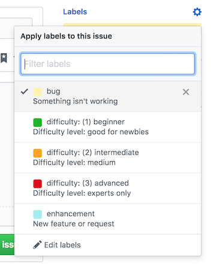

# SDJS Speaker App


## How to Contribute:

**Working on your first Pull Request?**

You can learn how from this _free_ series: [How to Contribute to an Open Source Project on GitHub](https://egghead.io/series/how-to-contribute-to-an-open-source-project-on-github).

#### Pre Requisites

Make sure to have these items installed. If you need help installing any of these, ask for help on the [SDJS Slack](https://sdjs.slack.com/).

1. node 10<=x<=12
2. npm (x>=6)
3. docker

### Getting Started

1. Fork the project


2. Clone your fork


```sh
$ git clone https://github.com/${YOUR-USERNAME}/sdjs-speaker-app.git
```

3. Make sure you are in the right directory:

```sh
$ cd sdjs-speaker-app
```

4. Add an `upstream` remote for keeping your local repository up-to-date:

```sh
$ git remote add upstream https://github.com/sandiegojs/sdjs-speaker-app.git
```

#### Spinning up the Server

Within the server folder, we'll startup the database and backend.

```sh
$ cd sdjs-speaker-app/server
```

We'll run this docker-compose command to get MongoDB running. (This may take a while the first time.)

```sh
$ docker-compose up -d
```

The `-d` tells docker to run in the background, later if we want to see logs from the db we can use: 

```sh
docker-compose logs --tail
```

We'll need to make a copy of the `.env` file.

> Note: The admin user is only created when there is none in the db, so make sure to change those variables _before_ running the server for the first time.

```sh
$ cp .env.example .env
```

Finally to run the backend app and initialize some config in the db, we'll install the dependencies and run the server.

```sh
$ npm i && npm run develop
```

#### Initializing the Frontend App

If you're going to run both apps at the same time, make sure to use a new terminal window/tab

```sh
$ cd sdjs-speaker-app/client
$ npm i && npm run dev
```


### Reporting Bugs

1. Click the "Issues" tab, or use [this link](https://github.com/sandiegojs/sdjs-speaker-app/issues) to navigate there:


2. Click on the "New issue" button:


3. Click on the "Get started" button to open a new bug report:


  - Create a title (keep it short and descriptive).
  - Fill in the template with specific information about the bug.

4. Click on the gear icon next to "Labels" and select the difficulty level required to fix the bug:



5. Scroll to the bottom of the page and click on the "Submit new issue" button:


### Creating a new PR

1. Make sure you are on the `master` branch, and you have pulled the latest changes:

```sh
$ git checkout master && git pull upstream master
```

2. Create a new branch off of the `master` branch:

```sh
$ git checkout -b [NEW-BRANCH-NAME]
```

   > **Branch naming conventions:**
   >
   > `fix/[BRANCH-NAME]` for bug fixes
   >
   > `feature/[BRANCH-NAME]` for new features
   >
   > `dev/[BRANCH-NAME]` for non-user-facing changes
   >
   > The `[BRANCH-NAME]` portion should be kebab case. For example, if you want to update the `README.md` file, your branch could be called `dev/update-readme`.

4. Make changes and commit them:

```sh
$ git add . && git commit -m "[YOUR COMMIT MESSAGE]"
```

> The subject of a commit message (the first line) should be 72 characters or less. If you need more room for a longer explanation of your changes, you can add a blank line below the subject and write a commit body. The commit message should be in present-imperative tense ("Update README.md" rather than "Updates" or "Updated").

5. Push your branch to your fork:

```sh
$ git push -u origin [BRANCH-NAME]
```

6. Open a new PR against the `master` branch from your fork using the GitHub user interface.


